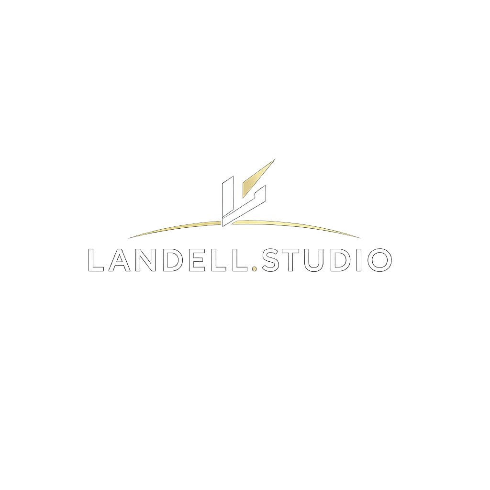

  

# Landell.Studio

# Landell.Studio

## 🕰️ Histórico do Projeto

Este projeto é a **versão final e consolidada** do antigo **port-dev**.  
O **port-dev** foi a primeira versão experimental do portfólio, servindo como laboratório de ideias e aprendizado.  

Agora, sob a identidade **Landell.Studio**, o projeto foi totalmente reestruturado e elevado a um novo patamar:  
- **Design premium** com estética refinada  
- **Tecnologia moderna** (Next.js, Tailwind, GSAP, Vercel)  
- **Narrativa profissional** alinhada à trajetória de Leonardo Landell  

O antigo **port-dev** cumpriu seu papel como base inicial.  
Esta versão final representa a evolução completa, pronta para produção e deploy em plataformas como **Vercel** e **GitHub Pages**.
